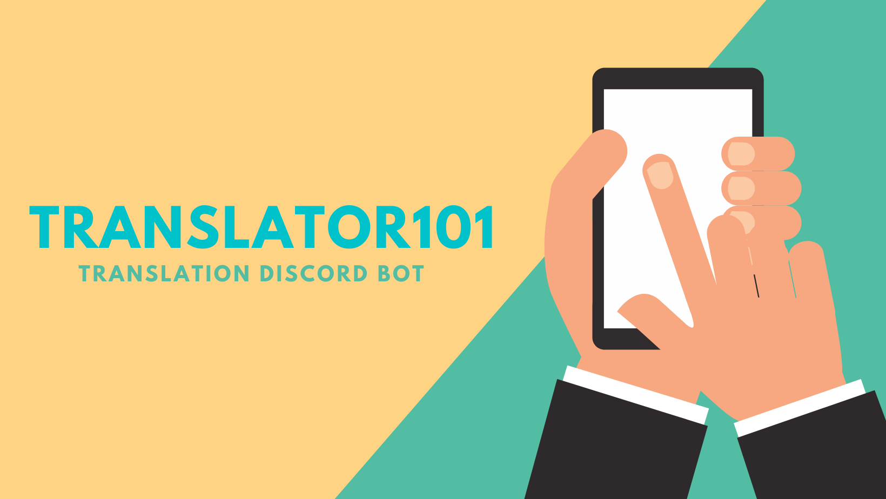

# Translator101

Translator101 is a discord bot designed to help connect the community by acting as a bridge between language barriers. It was made using discord.py and has various features like basic translation, live translation etc.

## Basic Setup and Help

## Translate feature

## Live Translate feature

## Contributing
Pull requests are welcome. For major changes, please open an issue first to discuss what you would like to change.

## License
[MIT](https://choosealicense.com/licenses/mit/)
